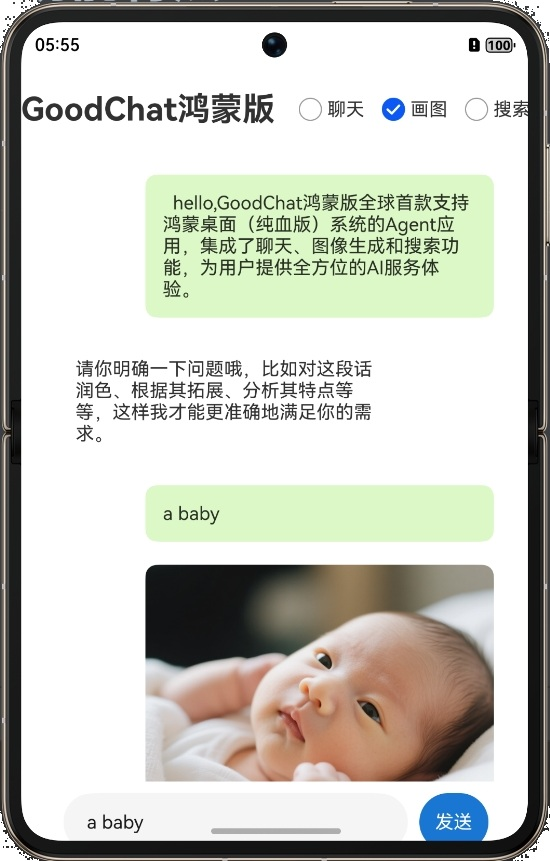

# GoodChat鸿蒙版
GoodChat鸿蒙版，全球首款支持鸿蒙桌面（纯血版）系统的Agent应用，集成了聊天、图像生成和搜索功能，为用户提供全方位的AI服务体验。

## 应用截图

### 手机版



### 平板版


### 电脑版


## 功能特点

### 多模式支持
- **聊天模式**：与AI助手进行自然语言对话
- **图像生成模式**：根据文本描述生成相应的图像
- **搜索模式**：实时搜索获取信息

### 用户友好界面
- 简洁直观的聊天界面设计
- 消息区分用户和AI回复，布局清晰
- 支持模式一键切换
- 加载状态实时展示

### 技术特点
- 基于ArkTS和HarmonyOS开发
- 模块化设计，易于维护和扩展
- 统一的API配置管理
- 响应式布局，适配不同屏幕尺寸

## 项目结构

```
entry/src/main/ets/
├── config/
│   └── ApiConfig.ets        # API配置文件
├── models/
│   └── ChatMessage.ets      # 消息模型
├── pages/
│   └── Index.ets            # 主页面
└── services/
    ├── LlmService.ets       # 聊天服务
    ├── ImageService.ets     # 图像生成服务
    └── SearchService.ets    # 搜索服务
```

## 使用方法

1. 启动应用后，默认进入聊天模式
2. 通过顶部的单选按钮切换不同模式
3. 在输入框中输入内容，点击发送按钮
4. 等待AI响应，结果将显示在聊天界面中

## 开发环境

- DevEco Studio 4.0或更高版本
- HarmonyOS SDK 4.0或更高版本
- 支持鸿蒙系统的设备或模拟器

## 配置说明

使用前需要在`config/ApiConfig.ets`文件中配置有效的API密钥：api密钥是指火山方舟的API key。

```typescript
static readonly API_KEY: string = '您的API密钥';
```

## 权限要求

应用需要以下权限：
- 网络访问权限（ohos.permission.INTERNET）

## 贡献指南

欢迎提交问题报告和功能建议。如果您想贡献代码，请遵循以下步骤：

1. Fork本仓库
2. 创建您的特性分支 (`git checkout -b feature/amazing-feature`)
3. 提交您的更改 (`git commit -m 'Add some amazing feature'`)
4. 推送到分支 (`git push origin feature/amazing-feature`)
5. 开启一个Pull Request

## 许可证

本项目采用MIT许可证 - 详情请参见LICENSE文件
